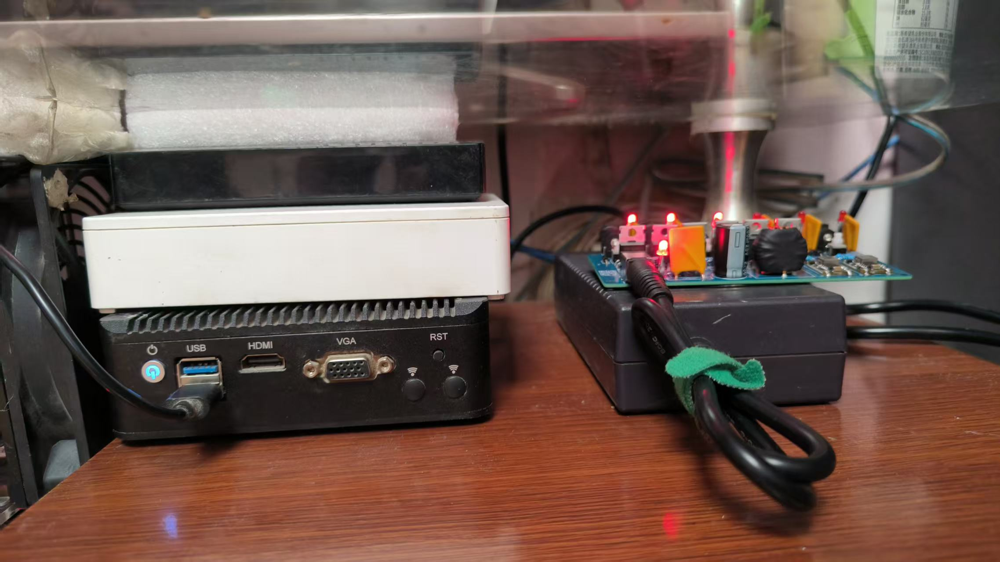
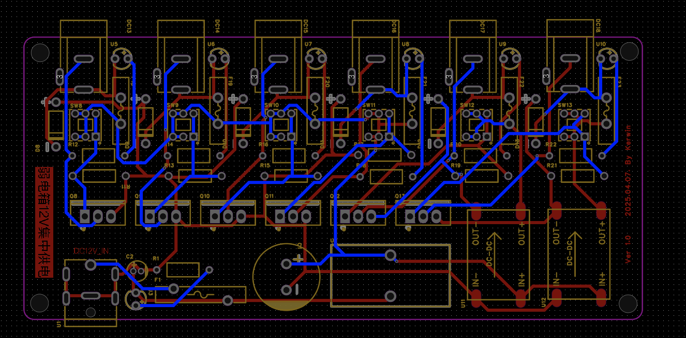
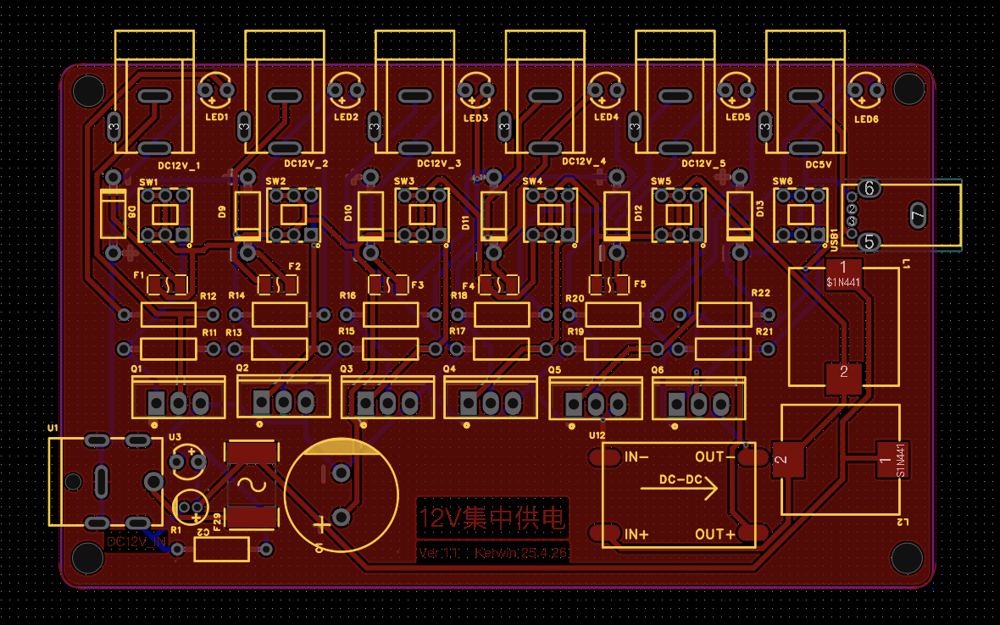

# 家庭12V集中供电系统 | Multi-Channel Power Hub

## 项目背景
现代家庭弱电设备激增导致电视柜/弱电箱区域出现"电源地狱"问题：光猫、软路由、交换机、开发板、AP、NAS等12V设备扎堆，传统插排难以承载大量"黑又粗"的电源插头。本项目通过集中供电方案，用单组高质量电源为多设备统一配电，解决线材凌乱和维护难题。

## 核心功能
- **多路输出架构**
  - 12V主输入：支持≥100W大功率电源（建议使用服务器拆机电源）
  - 12V分路：4路独立输出通道
  - 5V分路：2路降压输出
  
- **安全防护设计**
  - 主路配置自恢复保险丝
  - 每分路配备独立保险丝
  - 每分路配备自锁开关及指示led
  
- **增强稳定性**
  - 多级LC滤波网络（电感+电容）
  - EMI/RFI噪声抑制设计
  - 焊盘式大电流覆铜走线

## 硬件设计
### Ver 1.0（已验证）

- 板型参数：
  - PCB尺寸：120mm × 55mm
  - 层数：双面板
  - 特殊工艺：喷锡处理

### Ver 1.1（未验证）

- 优化改进：
  - LED极性修正（不再需要反接）
  - 改用贴片保险
  - 优化PCB尺寸至100mm*60mm
  - 布局紧凑化调整

## 系统参数
| 指标                | 规格          |
|---------------------|---------------|
| 输入电压            | DC 12V±15%    |
| 输入过流保护        | 10A (PPTC)     |
| 分路持续电流        | ≤5A/路        |
| 输出电压纹波        | <100mVpp      |
| 工作温度范围        | -20℃ ~ +85℃  |
| 转换效率（12V支路） | >99%          |

## 关键注意事项
1. **焊接注意**  
   - v1.0版本LED需反接引脚（PCB错误）
   - led亮度较高，介意的可以加大电阻

2. **选型建议**  
   - 主电源推荐100W以上工业级电源
   - 每分路负载建议不超过48W（12V×4A）

3. **安全警告**  
   - 禁止在潮湿环境使用
   - 各分路总和不得超过输入电源容量

## 项目资源
- 立创开源地址：https://oshwhub.com/kindom/ruo-dian-xiang-dian-yuan-_2025-04-02_13-08-02

## 测试记录
- **v1.0持续运行**  
  已连续运行60天，为以下设备供电：
  - 光猫（12V/1A）
  - x86软路由（12V/3A） 
  - 8口千兆交换机（12V/2A）
  - 开发板集群（12V/3A * 3）

## 开源协议
[GPL-3.0 License](LICENSE)  
允许商用/改造，需保留原作者信息，衍生项目必须开源。

**欢迎提交Issue或PR参与改进！**
